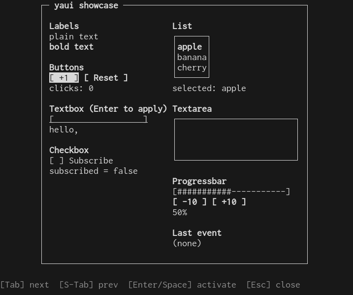
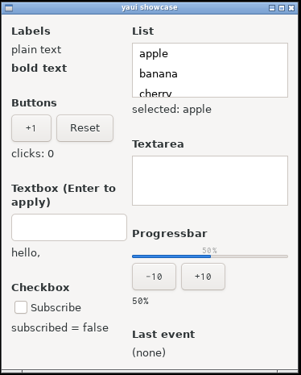
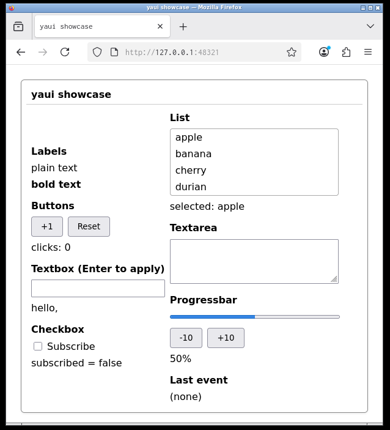

# yauitoolkit

シェルスクリプト（その他ほとんどの言語）から使える UI ツールキット。同じスクリプトが、ターミナル / デスクトップウィンドウ（GTK・Tkinter）/ ブラウザ で書き換えなしに動く。

スクリプトの仕事はとても単純：JSON の UI ツリーを stdout に書き、JSON のイベントを stdin から読むだけ。

## ショーケース

同一の `showcase.sh` を 3 つのランタイムで動かしたところ:

| TUI (curses) | GTK 3 | Web (SSE) |
|---|---|---|
|  |  |  |

## 起動

```sh
./yaui-tui test.sh    # ターミナル (curses)
./yaui-gtk test.sh    # デスクトップウィンドウ (GTK 3, Linux 向け)
./yaui-tk  test.sh    # デスクトップウィンドウ (Tkinter, Windows / macOS / Linux)
./yaui-web test.sh    # ブラウザ (http://127.0.0.1:<port>/)
```

## 最小例

```sh
#!/bin/sh
cat <<'EOL'
{"type":"dialog","content":[{"type":"label","text":"Hello, yaui!"}]}
EOL
read line   # stdin にイベントが届くまで待つ
```

## 同梱物

| ファイル       | 内容                                                 |
|----------------|------------------------------------------------------|
| `yaui-tui`     | TUI ランタイム（Python curses、依存ゼロ）            |
| `yaui-gtk`     | GTK 3 ランタイム（PyGObject）                        |
| `yaui-tk`      | Tkinter ランタイム（Windows/macOS の Python に標準同梱）|
| `yaui-web`     | ブラウザランタイム（Python `http.server` + SSE）     |
| `test.sh`      | Hello World                                          |
| `sample.sh`    | 入力フォーム（テキスト + チェック + OK/Cancel）      |
| `counter.sh`   | ボタンでカウントアップ                               |
| `monitor.sh`   | 時刻 / CPU / メモリ / ディスクをライブ表示           |
| `showcase.sh`  | 全ウィジェットを 1 ダイアログに集めたデモ            |
| `launcher.sh`  | dmenu_path 風: PATH 上の実行可能ファイルを絞り込み実行 |
| `PROTOCOL.md`  | UI ツリーとイベントの仕様                            |
| `AGENT.md`     | 開発ノート（ランタイムの構成・実装上の注意点）       |
| `idea.md`      | 設計の出発点メモ                                     |

## 実装済みウィジェット

`dialog` / `sdi` / `vbox` / `wbox` / `hbox` / `label` / `button` / `checkbox` / `textbox` / `textarea` / `progressbar` / `list`。詳細は [`PROTOCOL.md`](PROTOCOL.md)。

未実装（`idea.md` で挙がっている）: `tableview`, `tab`, `logview`, `icon`。

## 必要なもの

- Python 3.10+
- yaui-gtk: GTK 3 と PyGObject（Debian/Ubuntu なら `python3-gi` と `gir1.2-gtk-3.0`）
- yaui-tk: Tkinter（Windows/macOS の公式 Python インストーラに標準同梱、Debian/Ubuntu なら `python3-tk`）
- yaui-web: 標準ライブラリのみ。デフォルトでシステムブラウザを開く（`--no-browser` で抑止）

## デバッグ

`yaui-gtk --debug script.sh` / `yaui-tk --debug script.sh` / `yaui-web --debug script.sh` で、スクリプトから受信した UI ツリーを `[yaui-gtk UI] ...` / `[yaui-tk UI] ...` / `[yaui-web UI] ...` の形で stderr にダンプする。スクリプトの stderr はもともと貫通する（`echo "..." >&2` の出力がそのままターミナルに出る）。

## マルチヘッド (yaui-web)

複数タブ・別ブラウザを同時に開いてよい。1 タブで入れた値は他タブに peer event として即座に同期され、リロードしても入力中のテキスト・選択は復元される。詳細は [`PROTOCOL.md`](PROTOCOL.md#yaui-web-のマルチヘッド挙動)。

## テスト

```sh
python3 test_e2e.py            # yaui-tui を pty で起動して操作
python3 test_gtk.py            # yaui-gtk を Xvfb 上で起動して描画確認
python3 test_tk.py             # yaui-tk  を Xvfb 上で起動して描画確認
python3 test_web.py            # yaui-web の HTTP/SSE/POST を curl と urllib で検証
python3 test_web_multihead.py  # yaui-web のマルチタブ同期 / リロード復元を検証
```
